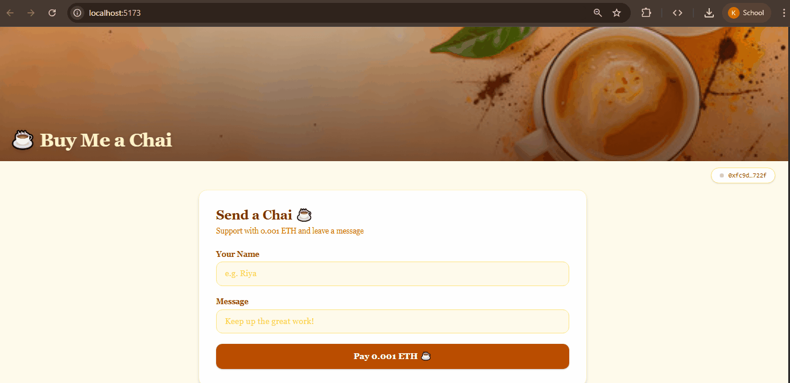
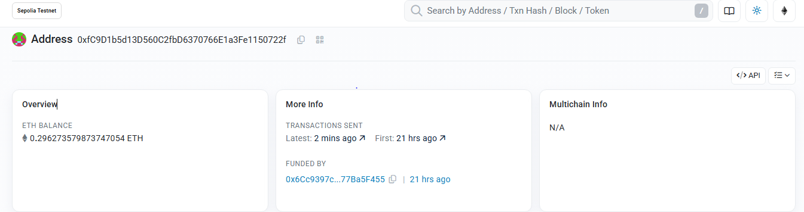
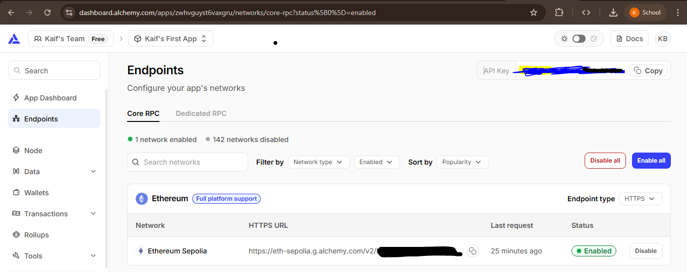
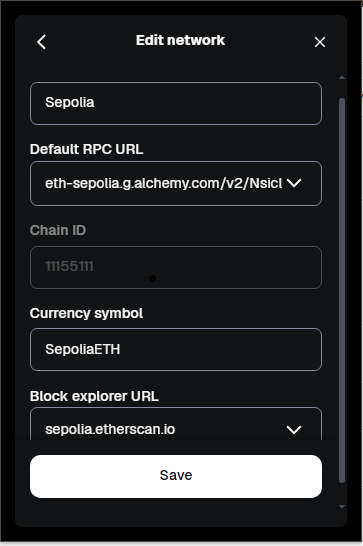
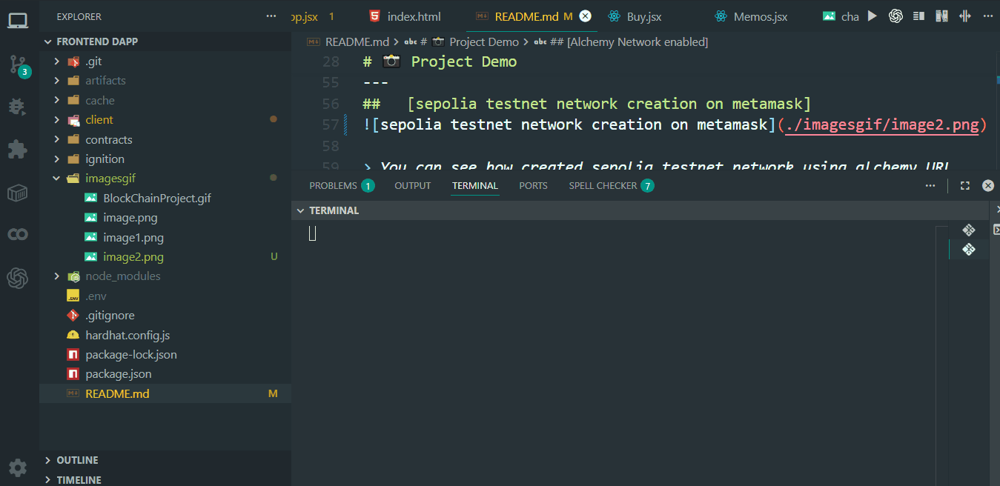

PLEASE REFER OFFICIAL DOCUMENTATION
[since many things change with time and many libraries or function get deprecated]
---

# ☕ Buy Me a Chai – Blockchain DApp

A decentralized application (DApp) where users can support the owner by sending **0.001 ETH** along with a custom message.

This project demonstrates end-to-end blockchain development using **Hardhat 2**, **Solidity**, **Ethers v6**, and deployment on **Sepolia Testnet**.

---

## 🚀 Tech Stack

* **Solidity** – Smart Contract Development
* **Hardhat 2** – Development & Deployment Framework
* **Hardhat Ignition** – Deployment Module System
* **Ethers v6** – Frontend Blockchain Interaction
* **React.js** – Frontend UI
* **Alchemy** – RPC URL Provider
* **Sepolia Testnet** – Ethereum Test Network
* **MetaMask** – Wallet Integration
* **Sepolia Faucet** – Test ETH Provider
* **Sepolia Etherscan** – Transaction Explorer

---

# 📸 Project Demo

##   Complete Working Flow



> ✍️ Full Working of Project
> Example: User connects MetaMask → Enters name & message → Sends 0.001 ETH → Transaction confirmed → Message stored on blockchain.

---

##   Sepolia EtherScan




>  See all transaction on Sepolia EtherScan
> All the Transactions are visible on sepolia etherscan just paste wallet or account address.

---

##   [Alchemy Network enabled]


> How we have activated testnet 
> We have created a testnet in alchemy and then used that testnet network in metamask .

---
##   [sepolia testnet network creation on metamask]


> You can see how created sepolia testnet network using alchemy URL
> edit sepolia testnet and put all values shown above

---
##   [Web Permission Changes in MetaMask]


> In this Demonstration I have shown what all changes you need to make in the metamask web permission tab in meta mask extension
> very important part otherwise you would get error

---

# 📂 Project Structure

```
Buy-me-Chai-Block-Chain-Project-
│
├── contracts/
│   └── Chai.sol
│
├── ignition/
│   └── modules/chai.js
│
├── client/          # React Frontend
│
├── hardhat.config.js
├── .env
└── README.md
```

---

# ⚙️ Installation & Setup

## 1️⃣ Clone Repository

```bash
git clone https://github.com/Skaif-123/Buy-me-Chai-Block-Chain-Project-.git
cd Buy-me-Chai-Block-Chain-Project-
```

---

## 2️⃣ Install Dependencies

```bash
npm install
cd client
npm install
cd ..
```

---

## 3️⃣ Compile Smart Contract

```bash
npx hardhat clean
npx hardhat compile
```

---

## 4️⃣ Deploy Contract to Sepolia

```bash
npx hardhat ignition deploy ./ignition/modules/chai.js --network sepolia
```

Make sure you have configured:

* Alchemy RPC URL
* Private key inside `.env`
* Sepolia network in `hardhat.config.js`

---

# 🔐 Environment Variables

Create a `.env` file in root folder:

```
SEPOLIA_RPC_URL=your_alchemy_rpc_url
PRIVATE_KEY=your_wallet_private_key
```

⚠️ Never share your private key publicly.

---

# 🦊 MetaMask Setup

1. Create account on MetaMask
2. Set default network to **Sepolia**
3. Untick / disable all other networks
4. Get test ETH from Sepolia Faucet
5. Make sure your wallet has enough test ETH for gas

---

# 💰 Getting Test ETH

* Visit Sepolia Faucet
* Paste your wallet address
* Receive free test ETH

---

# 🔎 View Transactions

After sending chai:

1. Copy transaction hash
2. Open Sepolia Etherscan
3. Paste transaction hash
4. View transaction details

---

# 📜 Smart Contract Features

* Users send **0.001 ETH**
* Users leave a custom message
* Contract stores:

  * Name
  * Message
  * Timestamp
  * Sender Address
* Owner can withdraw collected ETH

---

# 🧠 How It Works

React Frontend (Ethers v6)
⬇
MetaMask Wallet
⬇
Alchemy RPC
⬇
Sepolia Network
⬇
Smart Contract
⬇
Transaction visible on Sepolia Etherscan

---

# 📌 Important Notes

* This project runs on **Sepolia Testnet**
* Uses only **Test ETH**
* Do NOT use real ETH
* Always confirm MetaMask network = Sepolia

---

# 👨‍💻 Author

**KAIF AJAZ BHOMBAL**

GitHub Repository:
[https://github.com/Skaif-123/Buy-me-Chai-Block-Chain-Project-](https://github.com/Skaif-123/Buy-me-Chai-Block-Chain-Project-)

---

# ⭐ Support

If you like this project, please give it a ⭐ on GitHub!

---

I
